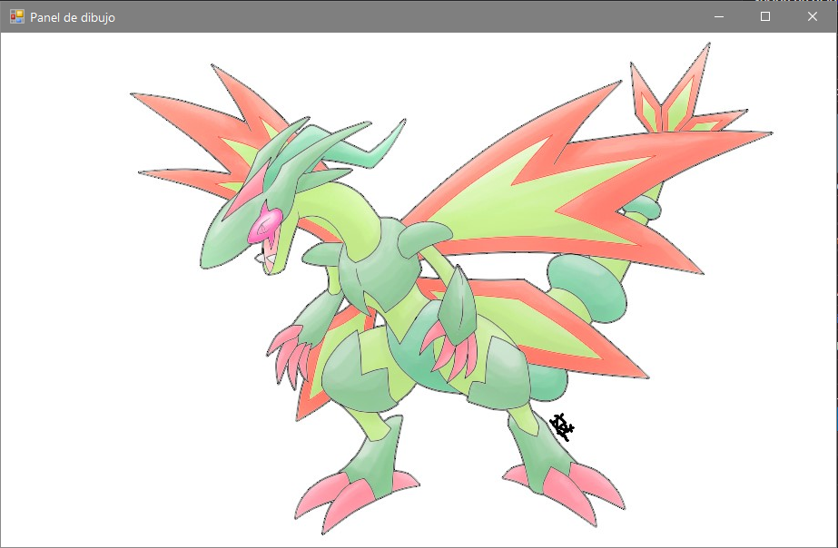
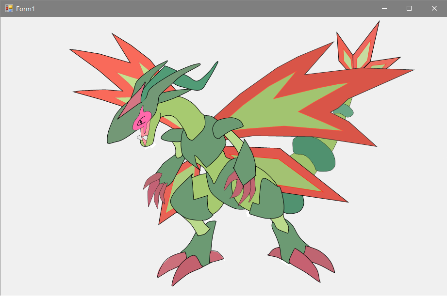
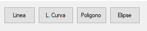

Proyecto de Visual Studio 20xx.

### Proposito
El proposito del software fue emplear practicas de programacion haciendo uso de la libreria de Graphics de net framework en c#.

Esto para hacer dibujos (vectoriales) en un panel por capas y modificar cada elemento grafico que hallas agregado en tiempo real

### Algo de su historia...
Fue resultado de un proyecto escolar donde se nos pedia "dibujar" una ilustración tan solo ejecutando funciones *draw* (de graphics) en un form,
pero mi pereza de tener que escribir cada linea a prueba y error me llevo a crear esta herramienta, la cual me permitio agregar lineas, curvas o poligonos en tiempo real
y poder modificarlos despues de haberlos agregado, gracias a esto pude entregar mi tarea con menos "esfuerzo" y una calidad aceptable:

   
    

# Uso
- Ejecuta GraficosDibujo\bin\Debug\GraficosDibujo.exe 

El uso del programa se divide en 3 modulos:

### Panel de dibujo
Lienzo sobre el cual se dibujan los graficos creados desde *Tools*.

Tambien sirve para dar click en donde quieres que se posicionen los nuevos elementos o que forma tendran.

Nota:
Se puede establecer una imagen de fondo para dibujar sobre ella (en el form: *Panel de dibujo*)

### Tools
Herramienta para agregar elementos graficos al panel de dibujo y editarlos (Posicion, color, tamaño, etc).

   

Seleccione el elemento a insertar y siga las instrucciones siguientes:
...

